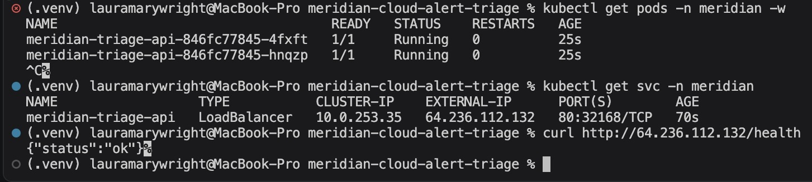
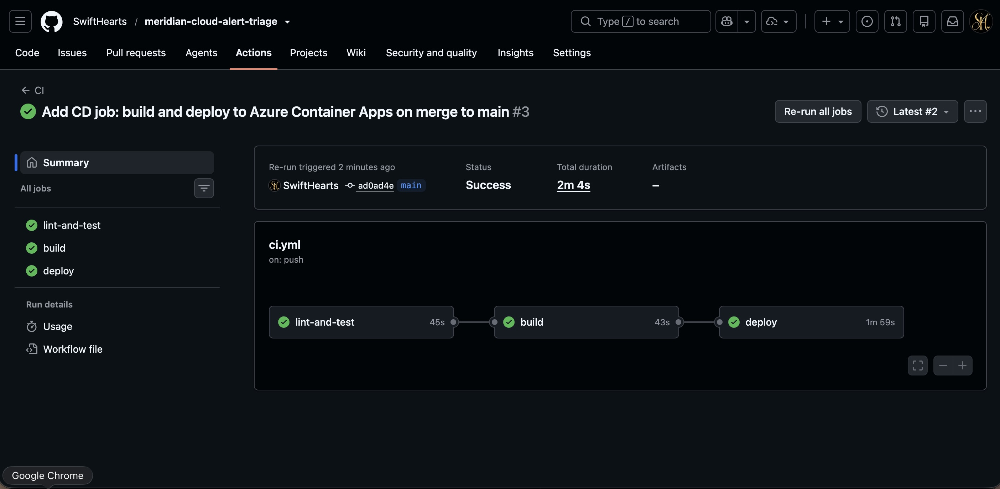
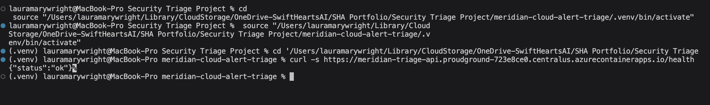
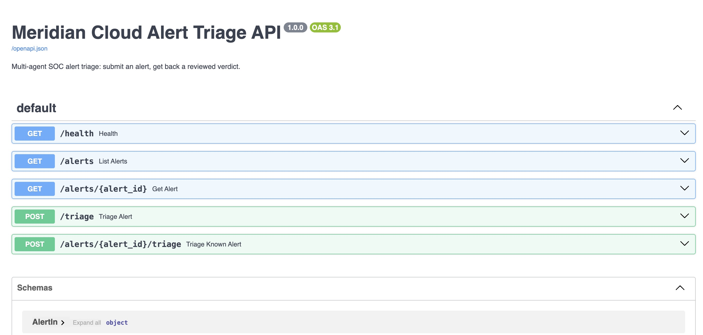

# Meridian Cloud Alert Triage

A multi-agent SOC alert triage pipeline: takes a raw security alert, retrieves
the relevant playbook and MITRE ATT&CK guidance, pulls in related activity from
an entity relationship graph, and produces a reviewed verdict — label, severity,
rationale, and recommended actions — through an analyst/reviewer agent pair
built on LangGraph. Scored against a held-out labeled set to check the
pipeline works, rather than just runs.

Meridian Cloud is a fictitious B2B SaaS company; all data is synthetic.

## Workplace Implemenatation

A SOC analyst's bottleneck isn't detection — it's the volume of alerts
that need a first-pass triage before anyone can act on them. This project is
a working model of that first pass: given one alert, decide whether it's a
false positive, needs a human to look closer, or is a genuine incident —
grounded in written playbook guidance and in what else has been happening
around the same host, user, or IP, rather than just the alert text in isolation.

## Architecture

```
raw alert
   │
   ▼
gather_context ──────► Azure AI Search (RAG)       playbook + MITRE ATT&CK
   │                    entity graph (NetworkX)      related host/user/ip/process activity
   ▼
analyst (LLM) ─────► proposes label + severity + rationale + actions
   │
   ▼
reviewer (LLM) ─────► approves, or rejects with feedback
   │
   ├── rejected (max 1 revision) ──► back to analyst
   │
   ▼
finalize ──────► verdict
```

Two things distinguish the "multi-agent" function from a single wrapped LLM call:
a. The reviewer sees the same retrieved context as the analyst and can reject a
verdict that ignores that context (e.g. a label that doesn't account for a
credential-dumping alert the graph shows on the same host minutes earlier).
b. The loop is bounded — one revision, then finalize, preventing a
disagreement in the pipeline.

## Build phases

| Phase | What | Key files |
|---|---|---|
| 1 | Synthetic data — 260 alerts (5 types × 52), 28 employees, 12 servers, a stratified 45-alert labeled eval subset | `ingestion/generate_synthetic_alerts.py` |
| 2 | RAG index — playbooks + MITRE ATT&CK chunked, embedded, indexed into Azure AI Search | `ingestion/index_to_azure_search.py`, `ingestion/verify_index.py` |
| 3 | Entity graph — NetworkX graph linking user/host/ip/process across all 260 alerts, for context expansion | `graph/entity_graph.py`, `graph/inspect_graph.py` |
| 4 | Multi-agent orchestration — LangGraph analyst/reviewer pipeline | `agents/rag_retrieval.py`, `agents/triage_graph.py`, `agents/run_triage.py` |
| 5 | Eval harness — scores the pipeline against ground-truth labels | `eval/run_eval.py` |
| 6 | UI — Streamlit app to run triage interactively and view eval results | `app/app.py` |

## Results

Scored on the 45-alert labeled eval set (`eval/run_eval.py`):

- **73.3%** label accuracy (false_positive / needs_investigation / true_positive)
- **0 missed true positives** — every real attack in the set was caught, either
  correctly labeled or escalated to `needs_investigation`; none were waved
  through as benign
- Every misclassification erred in the conservative direction (over-escalating,
  never under-escalating)
- Weakest category: `anomalous_login` (55.6%) — login-pattern alerts are
  inherently the most ambiguous without session/device context the synthetic
  data doesn't model
- Severity accuracy (44.4%) is noisier than label accuracy by design: the
  synthetic generator assigns severity partly at random within a label bucket
  (e.g. any `false_positive` gets a random low/low/medium regardless of alert
  content), so some of that gap is unresolvable ground-truth noise rather than
  pipeline error. Most misses are one notch off on the severity scale
  (medium↔high, high↔critical).

Full per-alert results: `eval/results.csv`.

## Entity graph

Built from all 260 alerts (not only the labeled subset): 192 nodes, 676 edges.
Nodes are typed (`host`, `user`, `ip`, `process`); edges carry the source
alert's id, type, and timestamp. Because a `dest_ip` in one alert is often the
same address another host reports as its own `source_ip` elsewhere, the graph
naturally chains alerts that share infrastructure into a single investigation
path — e.g. a lateral-movement alert into a host, followed days later by a
suspicious-process alert on that same host, surface together as one
neighborhood even though they'd never be correlated by alert type alone.

## Stack

Python · LangGraph · LangChain (`langchain-openai`) · Azure OpenAI
(`gpt-5-mini` for the agents, `text-embedding-3-small` for retrieval) ·
Azure AI Search (vector + filtered search) · NetworkX · pandas · Streamlit

## Deployment

The FastAPI layer (`api/main.py`) is containerized and ships through a full
CI/CD pipeline:

- **Docker** — `Dockerfile` packages the API; credentials are injected at
  runtime via env vars, never baked into the image.
- **Kubernetes** — proved end-to-end on Azure Kubernetes Service (pods
  `1/1 Running`, LoadBalancer with a public IP, `/health` responding) before
  being torn down to control cost. Manifests live in `k8s/`.

  

- **CI** — every push/PR runs lint (`ruff`) + tests (`pytest`) via GitHub
  Actions (`.github/workflows/ci.yml`).
- **CD** — every merge to `main` builds the image, pushes it to Azure
  Container Registry, and deploys it to Azure Container Apps automatically.
  Authentication uses OIDC federation between GitHub Actions and Azure
  (Entra ID App Registration + federated credential) — no long-lived
  cloud secrets stored in GitHub.

  

**Live demo:** https://meridian-triage-api.proudground-723e8ce0.centralus.azurecontainerapps.io/health





## Setup

```bash
python3 -m venv .venv
source .venv/bin/activate
pip install -r requirements.txt
```

Create a `.env` with:

```
AZURE_SEARCH_ENDPOINT=
AZURE_SEARCH_API_KEY=
AZURE_SEARCH_INDEX_NAME=meridian-cloud-security-index

AZURE_OPENAI_ENDPOINT=
AZURE_OPENAI_API_KEY=
AZURE_OPENAI_API_VERSION=2024-06-01
AZURE_OPENAI_EMBEDDING_DEPLOYMENT=text-embedding-3-small
AZURE_OPENAI_EMBEDDING_DIMENSIONS=1536
AZURE_OPENAI_CHAT_DEPLOYMENT=
```

This project shares a single free-tier Azure AI Search resource across
several of my portfolio projects via a dedicated index name — a deliberate
cost-control choice. `index_to_azure_search.py` only ever touches
`AZURE_SEARCH_INDEX_NAME`; it never reads or writes any other index that may
live in the same service.

## Running the App 

```bash
# 1. Generate the synthetic alert set (data/raw_alerts.json, data/eval_set.json)
python ingestion/generate_synthetic_alerts.py

# 2. Index playbooks + ATT&CK into Azure AI Search
python ingestion/index_to_azure_search.py
python ingestion/verify_index.py        # sanity check

# 3. Build the entity graph
python graph/entity_graph.py
python graph/inspect_graph.py           # sanity check

# 4. Run the triage pipeline on a few sample alerts
python agents/run_triage.py 5

# 5. Score it against the labeled eval set
python eval/run_eval.py

# 6. Launch the UI
streamlit run app/app.py
```

## Testing

```bash
pip install -r requirements-dev.txt
pytest
```

Unit tests only — no live Azure calls. Every Azure OpenAI, Azure AI Search,
and Cosmos DB Gremlin client is mocked at the boundary (`tests/conftest.py`
supplies fake credentials so the modules import cleanly without a real
`.env`), so the suite runs in under 2 seconds and never touches — or needs
access to — the real resources. Covers the triage graph's routing and
fallback logic (including the timeout/degradation paths in
`agents/triage_graph.py`), the FastAPI layer, and the Cosmos/RAG
query-building and response-mapping logic.

## Repo layout

```
data/               synthetic alerts, eval labels, playbooks, MITRE ATT&CK subset
ingestion/          synthetic data generation + RAG indexing
graph/              entity relationship graph (NetworkX) + Cosmos DB Gremlin backend
agents/             RAG retrieval + LangGraph analyst/reviewer pipeline
api/                FastAPI REST layer over the triage pipeline
eval/               scoring harness + results
app/                Streamlit UI
tests/              pytest suite (mocked Azure dependencies)
```


* This project was initially scaffolded with AI assistance, with each component subsequently reviwed in depth to build genuine mastery.*